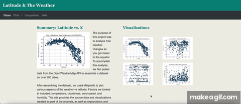

# HTML, CSS, and Bootstrap

I created a visualization dashboard website using visualizations I created in a past project using weather data, Python, and APIs. 

In building this dashboard, I created individual pages for each plot and a means by which the user can navigate between them. These pages contain the visualizations and their corresponding explanations. I also built a landing page, a page where we can see a comparison of all of the plots, and another page where we can view the data used to build them.
